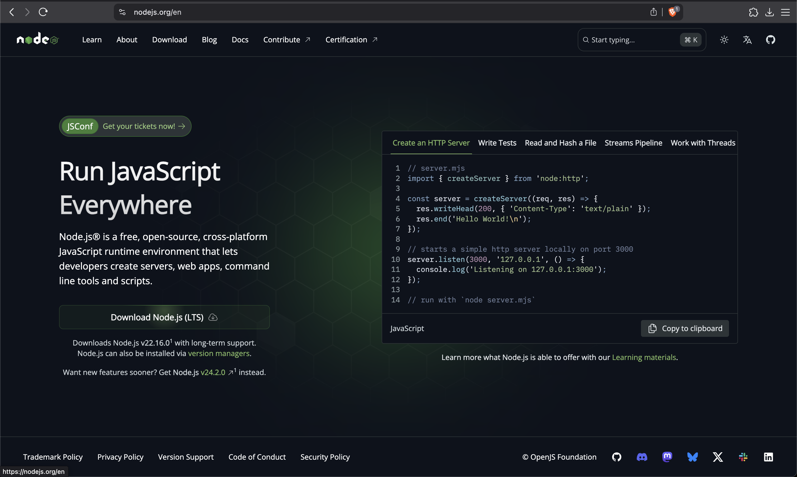
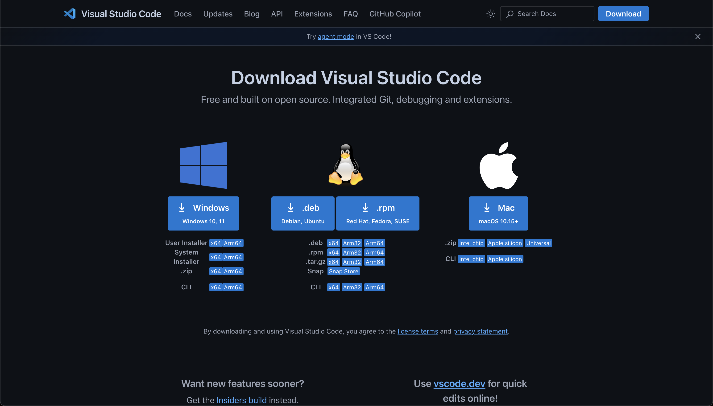

# Pre Workshop Steps for Macos

# Step 1 

Open App Store and Search Xcode and download it.

# Step 2

After Downloading Xcode

Open Xcode and go to settings

After Opening Settings Navigate to Components and Install IOS one.

# Step 3

# Step 4

Open Terminal

# Step 5

Install Bun or Node

I Prefer and use bun. You Can choose any one of them.

## Installing Bun

Visit https://bun.sh/ and select Macos Installation if not already selected.

Copy the command shown and paste it into the terminal.

## Installing Node

Visit https://nodejs.org/en and Install

Download the nodejs and proceed the installor.

# Step 6

Installing VSCode

Visit https://code.visualstudio.com/Download and Install for Macos.

# Final Step

Reopen the Terminal for enviornment paths that have been set to work.